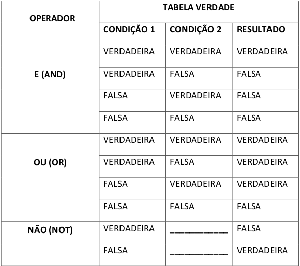

# Operadores lógicos

Quando programamos não raramente
precisamos reunir mais de um teste lógico em um único SE (`if`).  
Para trabalharmos com __mais
de uma condição__ utilizamos os __operadores lógicos__, a saber:

Caso queira entender melhor esses conceitos,recomendamos esse [vídeo](https://www.youtube.com/watch?v=28Ht3o1c73A).
____
  