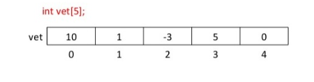

# Vetores

Vetores são __estruturas de dados__ que armazenam usualmente uma quantidade fixa de dados __de um certo tipo__.
Internamente, um vetor armazena diversos valores, cada um associado a um número que se refere à __posição de armazenamento__, e é conhecido como __índice__. Os vetores são estruturas
indexadas, em que cada valor que pode ser armazenado em uma certa posição __(índice)__ é
chamado de elemento do vetor.  





Cada elemento do vetor pode ser utilizado individualmente de forma direta, ou seja, pode ser
lido ou escrito diretamente, sem nenhuma regra ou ordem preestabelecida, fazendo dos vetores estruturas de dados de acesso aleatório. O __número de posições de um vetor corresponde ao tamanho que ele tem__;   
assim, um vetor de __tamanho *5*__ tem esse número de elementos, isto é, __pode armazenar até *cinco* elementos distintos__.

O _Java_ como as linguagens _C_ e _C++_ são linguagens com vetores __*zero-based*__, isto é, as posições
do vetor __iniciam a numeração a partir do valor 0__, portanto, um vetor de __tamanho *5*__ teria índices __iniciados em *0* prosseguindo até o *4*__ _(como na imagem acima)_.

_Exemplo de declaração, leitura e apresentação de um vetor em Java:_

```java
import java.util.Scanner;
public class LeCalculaVetor {
    public static void main(String[] args) {

        Scanner ler = new Scanner(System.in);

        final int TAM = 10; //definindo uma constante de tamanho 10

        int i, a[], b[];
        a = new int[TAM];
        b = new int[TAM]; 
        
        //leitura do vetor a 
        for (i=0; i < TAM; i++) {
            System.out.println("Entre com o "+(i+1)+"o. valor");

            a[i] = ler.nextInt();
            b[i] = a[i];
        }

        //apresentação do vetor b
        for (i=0; i<TAM; i++) {
            System.out.println("O "+(i+1)+"o. valor de b eh: "+b[i]);
        }

    }
}
```

___
<br><br>


