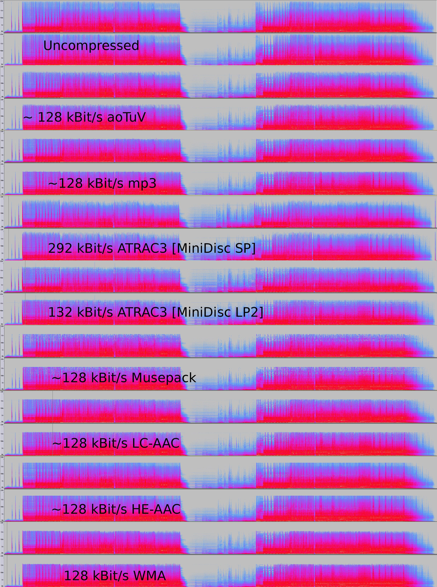

# Introdução à lógica de programação

<<<<<<< HEAD
## O que é lógica?

No dia-a-dia é comum utilizarmos a expressão **"é lógico"** quando nos deparamos
com algo óbvio, algo que é claro.  No entanto, a palavra lógica pode ter um outro
significado. Se recorrermos ao dicionário teremos os seguintes significados
(*dicionário Michaelis*):  

> *__1__. Modo de raciocinar tal como de fato se exerce: Lógica natural.*  
> *__2__. Estudo que tem por objeto determinar quais as operações que são válidas e quais as que não o são: Lógica formal, que trata dos conceitos, juízos e raciocínios, independentemente de seu conteúdo.*  
  
Ou seja, trata-se de uma forma de raciocinar, segundo os conceitos, juízos e
raciocínios. Logo, podemos concluir que a __Lógica de programação trata-se de uma
forma de raciocinar baseado em premissas e afirmações válidas__.  

Mais precisamente, podemos dizer que a lógica de programação é utilizada para __resolver problemas__ computacionais,
seguindo as __regras__ dos paradigmas de __programação__.  
  
Por exemplo, caso as seguinte premissas sejam verdadeiras:
>André é __maior__ que Estela.  
>Estela é __maior__ que Pedro. 

Pelo raciocínio lógico posso afirmar que __André é maior que Pedro__ _(Pedro < Estela < André)_.

## lógica de programação  

A lógica de programação trata ainda de ordenar o pensamento, ou seja, são passos a
serem seguidos para se __solucionar um problema__ computacional.  

Esse problema pode ser a execução de um cálculo matemático, a análise de um
dado, a gravação de uma informação em um banco de dados, etc... Infinitas são a
possibilidades do que a lógica de programação pode solucionar.

## Desafio lógico

_Numa gaveta, em um quarto escuro existem 6 pares de meias vermelhas, sendo que
tem-se 2, 5 vezes desse valor de meias brancas. A quantidade de meias brancas
dividida por 3 resulta no total de meias na cor azul, e a quantidade de meias
amarelas é 2 vezes a quantidade de meias azuis.
Sabendo-se que o quarto está totalmente escuro, e que não há como identificar as
meias pela cor, indique a mínima de pés de meia que deve ser retirada da gaveta de
uma única vez para garantir que ao menos um par de meias da mesma cor será
sorteado._  
  
## Algoritmos  
Em informática, o raciocínio lógico nos
permite ordenarmos o pensamento para resolvermos problemas computacionais,
ou seja, a lógica de programação trata de indicar os passos a serem seguidos para
que um problema seja resolvido.

Para tal existem uma gama de ferramentas que auxiliam o programador a estruturar
sua lógica de programação, sendo que a ferramenta inicial é o __ALGORITMO__.

Um __algoritmo__ é uma sequência de passos lógicos, ordenados e enumerados que
visam atingir um objetivo pré-definido.


### Como o [Google Maps](https://www.google.com.br/maps/) sabe como ir de São Paulo para a Bahia pelo menor caminho possível?

Ele utiliza de __algoritmos de localização de rotas__. 

   

_(O algoritmo acima se chama [Dijkstra's algorithm](https://en.wikipedia.org/wiki/Dijkstra's_algorithm))_


### Como os Hangouts do Google transmitem Lives vídeos através da internet tão rápido?

Eles usam __Algoritmos de compressão__ para áudios e vídeos.  

  

Obviamente que os algoritmos apresentados são bastantes complexos e não muito comuns na nossa vida cotidiana, Porém, no nosso dia-a-dia, Nós utilizamos algoritmos simples. Não acredita?   

Então veja. por exemplo, um algoritmo que você faz ao __atravessar a rua__:
```
Inicio
    Olhar para direita
    Olhar para a esquerda 
    Se estiver vindo carro
        Não atravesse
    Senão
        Atravesse
fim
``` 

Caso os passos sejam __invertidos__, por exemplo, se eu primeiro tentar atravessar a rua e depois olhar para direita, O meu objetivo não vai ser atingido com sucesso _(A única coisa que provavelmente será atingida será você)_.  

Então, quando se trata de um algoritmo computacional, nós devemos __identificar o problema__ _(objetivo)_, __descobrir as informações__ e
__enumerar as ações a serem seguidas para se chegar ao objetivo__.

___


###### desculpa pelo texto. É um pouco grande mas ler é bom, cara. Confia em mim... 

